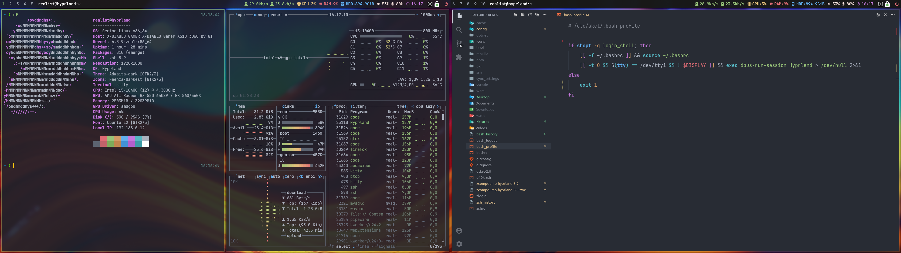
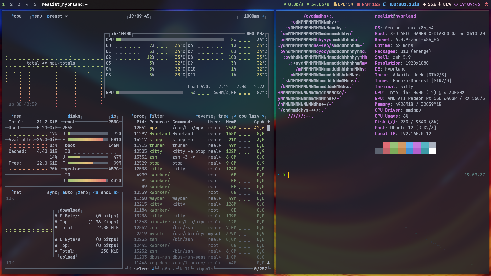

# Realist's Hyprland Minimal Desktop [ RHMD ] on Gentoo Linux

## About this project

This project contains complete installation commands and config files for create Gentoo linux with Hyperland desktop. This desktop is intended for web developers, but it can also be used by a regular user.

## Final desktop - Dual monitors screenshot



## Final desktop - One monitor screenshot



## Grub Screen


## Create install environment

### Partitions
```
parted -s /dev/sda mklabel gpt && parted -a optimal /dev/sda
```

#### Parted commands

```
unit mib
mkpart primary fat32 1 150
name 1 UEFI
set 1 bios_grub on
mkpart primary 150 -1
name 2 ROOT
quit
```
```
mkfs.fat -n UEFI -F32 /dev/sda1 && mkfs.f2fs -l ROOT -O extra_attr,inode_checksum,sb_checksum -f /dev/sda2
```
```
mkdir -p /mnt/gentoo && mount -t f2fs /dev/sda2 /mnt/gentoo
```
```
mkdir -p /mnt/gentoo/boot && mount /dev/sda1 /mnt/gentoo/boot
```

### Stage3 and config portage

```
cd /mnt/gentoo
```
```
wget https://distfiles.gentoo.org/releases/amd64/autobuilds/20240609T164903Z/stage3-amd64-openrc-20240609T164903Z.tar.xz
```
```
tar xpf stage3-amd64-openrc-20240609T164903Z.tar.xz --xattrs-include='*.*' --numeric-owner
```
```
mkdir -p /mnt/gentoo/var/db/repos/gentoo && mkdir -p /mnt/gentoo/etc/portage/repos.conf
```
```
cp /mnt/gentoo/usr/share/portage/config/repos.conf /mnt/gentoo/etc/portage/repos.conf/
```
```
cp /etc/resolv.conf /mnt/gentoo/etc/
```

### Mounting important system FS

```
mount -t proc none /mnt/gentoo/proc && mount -t sysfs none /mnt/gentoo/sys
```
```
mount --rbind /sys /mnt/gentoo/sys && mount --make-rslave /mnt/gentoo/sys
```
```
mount --rbind /dev /mnt/gentoo/dev && mount --make-rslave /mnt/gentoo/dev
```
```
mount --rbind /run /mnt/gentoo/run && mount --make-rslave /mnt/gentoo/run
```
```
test -L /dev/shm && rm /dev/shm && mkdir /dev/shm
```
```
mount --types tmpfs --options nosuid,nodev,noexec shm /dev/shm && chmod 1777 /dev/shm
```

### Chroot to prepared system

```
chroot /mnt/gentoo /bin/bash && env-update && source /etc/profile
```

### Sync and config portage

```
emerge-webrsync
```
```
cd /etc/portage/
```
```
rm make.conf && rm -R package.use && rm -R package.accept_keywords && rm -R package.mask
```

### File - /etc/portage/make.conf

```
wget https://raw.githubusercontent.com/lotrando/realist-hyprland-desktop/main/make.conf
```

```
# RHMD
# Realist Hyperland Minimal Desktop LTO & GPO version
# make.conf file (c) 2024 -> /etc/portage/make.conf
# (c) 2024

USE="dbus elogind jpeg png svg pipewire nls vulkan wayland -X -bluetooth -perl"
CPU_FLAGS_X86="aes avx avx2 f16c fma3 mmx mmxext pclmul popcnt rdrand sse sse2 sse3 sse4_1 sse4_2 ssse3"

COMMON_FLAGS="-O2 -pipe -fomit-frame-pointer"
CFLAGS="${COMMON_FLAGS}"
CXXFLAGS="${COMMON_FLAGS}"
FCFLAGS="${COMMON_FLAGS}"
FFLAGS="${COMMON_FLAGS}"
MAKE_OPTS="-j6"

GENTOO_MIRRORS="https://mirror.dkm.cz/gentoo/"
PORTAGE_BINHOST="http://94.113.201.164:55/hyprland"
PORTDIR="/var/db/repos/gentoo"
DISTDIR="/var/cache/distfiles"
PKGDIR="/var/cache/binpkgs"
PORTAGE_NICENESS=19
PORTAGE_IONICE_COMMAND="ionice -c 3 -p \${PID}"
EMERGE_DEFAULT_OPTS="-v --ask-enter-invalid --jobs=1 --load-average=4"
FEATURES="buildpkg parallel-fetch"

ACCEPT_KEYWORDS="amd64"
ACCEPT_LICENSE="-* @FREE"
GRUB_PLATFORMS="pc efi-64"

L10N="cs"

INPUT_DEVICES="libinput"
VIDEO_CARDS="amdgpu radeonsi vmware"
```

### File - /etc/portage/package.accept_keywords

```
wget https://raw.githubusercontent.com/lotrando/realist-hyprland-desktop/main/package.accept_keywords
```

```
# RHMD
# Realist Hyperland Minimal Desktop LTO & GPO version
# package.accept_keywords file -> /etc/portage/package.accept_keywords
# (c) 2024

# APP-EDITORS
app-editors/sublime-text ~amd64
app-editors/vscode ~amd64

# APP-MISC
app-misc/ca-certificates ~amd64
app-misc/nwg-look ~amd64

# APP-SHELLS
app-shells/oh-my-zsh ~amd64
app-shells/zsh-autosuggestions ~amd64
app-shells/zsh-syntax-highlighting ~amd64

# DEV-CPP
dev-cpp/sdbus-c++ ~amd64

# DEV-LANG
dev-lang/php ~amd64

# DEV-PHP
dev-php/ca-bundle ~amd64
dev-php/composer ~amd64
dev-php/json-schema ~amd64
dev-php/jsonlint ~amd64
dev-php/metadata-minifier ~amd64
dev-php/phar-utils ~amd64
dev-php/php ~amd64
dev-php/psr-log ~amd64
dev-php/semver ~amd64
dev-php/spdx-licenses ~amd64
dev-php/symfony-config ~amd64
dev-php/symfony-console ~amd64
dev-php/symfony-dependency-injection ~amd64
dev-php/symfony-event-dispatcher ~amd64
dev-php/symfony-filesystem ~amd64
dev-php/symfony-finder ~amd64
dev-php/symfony-process ~amd64
dev-php/xdebug-handler ~amd64

# DEV-UTIL
dev-util/rocm-smi ~amd64

# GUI-APPS
gui-apps/hyprpaper ~amd64
gui-apps/hyprpicker ~amd64
gui-apps/rofi-wayland ~amd64
gui-apps/waybar ~amd64
gui-apps/wlogout ~amd64

# GUI-LIBS
gui-libs/xdg-desktop-portal-hyprland ~amd64

# GUI-WM
gui-wm/hyprland-contrib ~amd64

# MEDIA-VIDEO
media-video/pipewire ~amd64
media-video/wireplumber ~amd64

# NET-MISC
net-misc/youtube-viewer ~amd64

# SYS-APSS
sys-apps/eza ~amd64

# SYS-KERNEL
sys-kernel/zen-sources ~amd64

# X11-APPS
x11-apps/xcur2png ~amd64
```

### File - /etc/portage/package.use

```
wget https://raw.githubusercontent.com/lotrando/realist-hyprland-desktop/main/package.use
```

```
# RHMD
# Realist Hyperland Minimal Desktop LTO & GPO version 2024
# package.use file -> /etc/portage/package.use
# (c) 2024

*/* PYTHON_TARGETS: python3_11 python3_12
*/* PYTHON_SINGLE_TARGET: -python3_11 python3_12

# APP-ARCH
app-arch/xz-utils pgo

# APP-CRYPT
app-crypt/gcr gtk

# APP-ESELECT
app-eselect/eselect-php apache2 fpm

# APP-MISC
app-misc/mc -slang unicode gpm sftp

# APP-TEXT
app-text/poppler cairo
app-text/xmlto text

# DEV-CPP
dev-cpp/cairomm X
dev-cpp/gtkmm X

# DEV-LANG
dev-lang/php apache2 bcmath curl fpm gd mysql mysqli pdo soap sockets spell sqlite xmlreader xmlwriter zip
dev-lang/python pgo

# DEV-LIBS
dev-libs/libdbusmenu gtk3

# DEV-QT
dev-qt/qtgui egl X

# GNOME-BASE
gnome-base/gvfs cdda http udisks nfs archive fuse

# GUI-APPS
gui-apps/rofi-wayland drun windowmode
gui-apps/waybar pulseaudio udev network tray upower wifi evdev
gui-apps/wlogout zsh-completions

# GUI-LIBS
gui-libs/wlroots X tinywl 11-backend

# GUI-WM
gui-wm/hyprland X

# MEDIA-FONTS
media-fonts/terminus-font -ru-g

# MEDIA-GFX
media-gfx/imagemagick djvu jpeg svg xml zip

# MEDIA-LIBS
media-libs/libepoxy X
media-libs/libglvnd X
media-libs/libsdl2 gles2 X
media-libs/libvpx postproc
media-libs/mesa X

# MEDIA-PLUGINS
media-plugins/audacious-plugins nls pipewire cdda cue ffmpeg flac http lame libnotify modplug mp3 opus sndfile wavpack

# MEDIA-VIDEO
media-video/ffmpeg modplug mp3 opus pulseaudio svg v4l openh264 libv4l webp x264 x265 xvid
media-video/mpv cdda dvd jpeg
media-video/pipewire sound-server v4l

# NET-P2P
net-p2p/transmission appindicator qt5

# SYS-BOOT
sys-boot/grub mount

# SYS-DEVEL
sys-devel/binutils pgo
sys-devel/gcc graphite lto pgo

# SYS-KERNEL
sys-kernel/installkernel dracut
sys-kernel/linux-firmware initramfs
sys-kernel/zen-sources symlink

# WWW-CLIENT
www-client/firefox lto pgo pulseaudio

# X11-LIBS
x11-libs/cairo X
x11-libs/gtk+ X
x11-libs/libdrm video_cards_radeon
x11-libs/libxkbcommon X
x11-libs/pango X

# XFCE-BASE
xfce-base/thunar exif udisks
xfce-base/tumbler epub ffmpeg jpeg odf pdf
```

### Edit file - /etc/portage/package.license

```
wget https://raw.githubusercontent.com/lotrando/realist-hyprland-desktop/main/package.license
```

```
# RHMD
# Realist Hyperland Minimal Desktop LTO & GPO version
# package.license file -> /etc/portage/package.license
# (c) 2024

# APP-EDITORS
app-editors/vscode Microsoft-vscode
app-editors/sublime-text Sublime

# SYS-KERNEL
sys-kernel/linux-firmware linux-fw-redistributable no-source-code
```

### Edit file - /etc/portage/package.mask

```
wget https://raw.githubusercontent.com/lotrando/realist-hyprland-desktop/main/package.mask
```

```
# RHMD
# Realist Hyperland Minimal Desktop LTO & GPO version
# package.mask file -> /etc/portage/package.mask
# (c) 2024
```

### Edit file - /etc/fstab

```
nano /etc/fstab
```
```
/dev/sda1         /boot   vfat    noatime       0 2
/dev/sda2         /       f2fs    defaults,rw   0 0
```

```
sed -i 's/localhost/hyprland/g' /etc/conf.d/hostname
```
```
sed -i 's/default8x16/ter-v16b/g' /etc/conf.d/consolefont
```
```
sed -i 's/us/cz/g' /etc/conf.d/keymaps
```
```
sed -i 's/127.0.0.1/#127.0.0.1/g' /etc/hosts
```
```
echo "127.0.0.1 hyprland.gentoo.dev hyprland localhost" >> /etc/hosts
```

### Edit file - /etc/locale.gen

```
nano /etc/locale.gen
```

```
cs_CZ.UTF-8 UTF-8
cs_CZ ISO-8859-2
```
```
echo "Europe/Prague" > /etc/timezone
```

### Create locale

```
locale-gen
```
```
eselect locale set 4 # -> C.utf8
```
```
env-update && source /etc/profile
```

```
export PS1="(chroot) ${PS1}"
```

### Edit file - /etc/conf.d/net

## Static network (variable, default dhcp)

```
nano /etc/conf.d/net
```
```
config_enp0s3="192.168.0.30 netmask 255.255.255.0"
routes_enp0s3="default via 192.168.0.1"
```
```
cd /etc/init.d/
```
```
ln -s net.lo net.enp0s3
```

## Compiling phase

```
emerge -g python gcc llvm && emerge -NDU @world
```

### Create zen-kernel and install important system packages

```
emerge -g dhcpcd grub os-prober terminus-font sudo f2fs-tools dev-vcs/git usbutils eselect-repository genkernel linux-firmware zen-sources --noreplace nano && genkernel all
```

### Add repository overlay mv for OH-MY-ZSH

```
eselect repository enable mv && emaint sync -r mv && emerge --oneshot sys-apps/portage
```
```
emerge oh-my-zsh gentoo-zsh-completions zsh-completions
```

### Install oh-my-zsh plugins and p10k theme

```
git clone https://github.com/romkatv/powerlevel10k.git /usr/share/zsh/site-contrib/oh-my-zsh/custom/themes/powerlevel10k
```
```
git clone https://github.com/zsh-users/zsh-autosuggestions.git /usr/share/zsh/site-contrib/oh-my-zsh/custom/plugins/zsh-autosuggestions
```
```
git clone https://github.com/zsh-users/zsh-syntax-highlighting.git /usr/share/zsh/site-contrib/oh-my-zsh/custom/plugins/zsh-syntax-highlighting
```

## Desktop - HYPRLAND
```
eselect repository enable guru && emaint sync -r guru
```
```
emerge seatd hyprland hyprpaper hyprland-contrib xdg-desktop-portal-hyprland waybar grim slurp kitty pipewire eix gentoolkit ubuntu-font-family gvfs rofi-wayland qt5ct faenza-icon-theme adwaita-qt wlogout pulsemixer pavucontrol mpv audacious roboto imagemagick firefox eza neofetch btop rocm-smi thunar xarchiver thunar-media-tags-plugin thunar-archive-plugin media-video/ffmpegthumbnailer ristretto tumbler app-misc/mc
```

## Variable
```
emerge virtualbox && gpasswd -a realist vboxuser
```

### Create user (replace realist and toor with custom user and password)

```
useradd -m -G audio,video,usb,cdrom,portage,users,wheel,pipewire,vboxuser,input -s /bin/bash realist
```
```
echo "root:toor" | chpasswd -c SHA256
```
```
echo "realist:toor" | chpasswd -c SHA256
```

### Install WEB developers packages ( optional )

```
emerge phpmyadmin dev-db/mysql dev-lang/php nodejs composer vscode sublime-text
```

### Set PHP version for CLI and APACHE

```
eselect php set cli php8.2 && eselect php set apache2 php8.2
```

### Config WEB Develop enviroment PHP, APACHE, MYSQL, PHPMYADMIN

```
rm -R /usr/lib/tmpfiles.d/mysql.conf
```
```
echo "d /run/mysqld 0755 mysql mysql -" > /usr/lib/tmpfiles.d/mysql.conf
```
```
sed -i 's/SSL_DEFAULT_VHOST/PHP/g' /etc/conf.d/apache2
```
```
echo "ServerName localhost" >> /etc/apache2/httpd.conf
```
```
rm -R /var/www/localhost/htdocs/index.html && echo "<?php phpinfo(); ?>" > /var/www/localhost/htdocs/index.php
```
```
cp /var/www/localhost/htdocs/phpmyadmin/config.sample.inc.php /var/www/localhost/htdocs/phpmyadmin/config.inc.php
```
```
mkdir /var/www/localhost/htdocs/phpmyadmin/tmp/
```
```
chown -R apache:apache /var/www/ && usermod -aG apache realist
```
```
chmod -R 775 /var/www/localhost/htdocs && chmod -R 777 /var/www/localhost/htdocs/phpmyadmin/tmp
```

### Add Blowfish secret to phpmyadmin

```
nano /var/www/localhost/htdocs/phpmyadmin/config.inc.php
```
```
$cfg['blowfish_secret'] = 'WntN0150l71sLq/{w4V0:ZXFv7WcB-Qz';
```

### Mysql root password

```
emerge --config mysql
```

## Configurations

### Grubdev-python/pygobject
```
nano /etc/default/grub
```
```
GRUB_GFXMODE=1920x1080x32
GRUB_GFXPAYLOAD_LINUX=keep
GRUB_BACKGROUND="/boot/grub/grub.png"
GRUB_DISABLE_OS_PROBER=0
GRUB_DEFAULT=0
GRUB_TIMEOUT=5
```

### Sudo

```
sed -i 's/# %wheel ALL=(ALL:ALL) ALL/%wheel ALL=(ALL:ALL) ALL/g' /etc/sudoers
```

### USER - dotfiles setting

```
cd /home/realist
```
```
git clone https://github.com/lotrando/realist-hyprland-desktop-rice.git
```
```
chown -R realist:realist /home/realist/
```

### Change default shell to OH-MY-ZSH

```
chsh -s /bin/zsh root && chsh -s /bin/zsh realist
```

### Grub Install
```
grub-install --target=x86_64-efi --efi-directory=/boot --bootloader-id=HYPRLAND --recheck /dev/sda
```
```
cd /boot/grub && wget -q wget https://raw.githubusercontent.com/lotrando/realist-hyprland-desktop/main/grub.png
```
```
grub-mkconfig -o /boot/grub/grub.cfg
```

### Run daemons

```
rc-update add elogind boot && rc-update add consolefont default && rc-update add numlock default
```
```
rc-update add sshd default && rc-update add dbus default && rc-update add dhcpcd default
```
```
rc-update add mysql default && rc-update add apache2 default
```


### Cleaning and reboot to Hyprland desktop

```
cd / && umount -R /mnt/gentoo && reboot
```

# Keybinding of Hyprland desktop (Complete)

| Keys                | Function                                                 |
| ------------------- | -------------------------------------------------------- |
| Win-Shift-Enter     | Rofi Drun                                                |
| Win-Shift-Backspace | Rofi Apps                                                |
| Win-Shift-p         | Rofi Powermenu                                           |
| Win-Shift-q         | Hyperland Quit                                           |
| Win-Shift-c         | Kill focused window                                      |
| Win-Enter           | Run Kitty                                                |
| Win-Alt-b           | Run Firefox                                              |
| Win-Alt-f           | Run Thunar                                               |
| Win-Alt-t           | Run Btop                                                 |
| Win-j               | Shrink vert window width                                 |
| Win-m               | Move focus to the master window                          |
| Win-Up              | Move focus to the next window                            |
| Win-Down            | Move focus to the prev window                            |
| Win-Right.          | Switch focus to next monitor                             |
| Win-Left,           | Switch focus to prev monitor                             |
| Win-t               | Toggle floating window back to tile                      |
| Win-Space           | Toggles noborder/full                                    |
| Win-s               | Grab all monitors screenshot                             |
| Win-Alt-s           | Chose monitor to grab screenshot                         |
| Win-Alt-a           | Chose area to grab screenshot                            |
