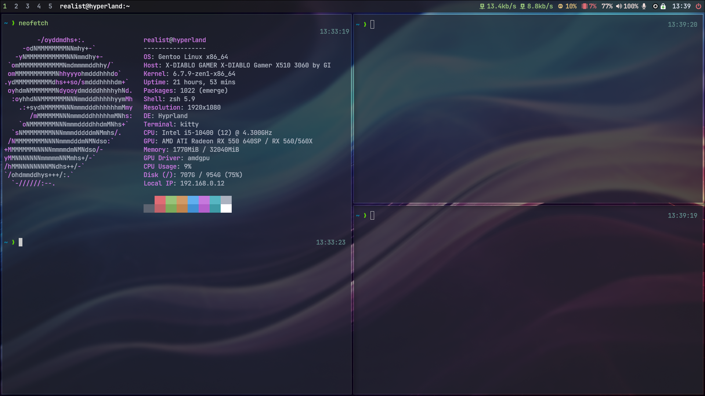

# Realist's Hyprland Minimalistic Desktop [ RHMD ] on Gentoo Linux

## About this project

This project contains complete installation commands and config files for create Gentoo linux with Hyperland desktop.
This desktop is intended for web developers, but it can also be used by a regular user.

## Final desktop One monitor screenshot



## Grub background


## Create install environment

### Partitions
SSD / SATA Disk

```
parted -s /dev/sda mklabel gpt && parted -a optimal /dev/sda
```

#### Parted commands

```
unit mib
mkpart primary fat32 1 150
name 1 UEFI
set 1 bios_grub on
mkpart primary 150 -1
name 2 ROOT
quit
```

SSD or SATA disk (Virtualbox)

```
mkfs.fat -n UEFI -F32 /dev/sda1 && mkfs.f2fs -l ROOT -O extra_attr,inode_checksum,sb_checksum -f /dev/sda2
```

```
mkdir -p /mnt/gentoo && mount -t f2fs /dev/sda2 /mnt/gentoo
```

```
mkdir -p /mnt/gentoo/boot && mount /dev/sda1 /mnt/gentoo/boot
```

### Stage3 and config portage

```
cd /mnt/gentoo
```

```
wget https://distfiles.gentoo.org/releases/amd64/autobuilds/20240514T170404Z/stage3-amd64-openrc-20240514T170404Z.tar.xz
```

```
tar xpf stage3-amd64-openrc-20240514T170404Z.tar.xz --xattrs-include='*.*' --numeric-owner
```

```
mkdir -p /mnt/gentoo/var/db/repos/gentoo && mkdir -p /mnt/gentoo/etc/portage/repos.conf
```

```
cp /mnt/gentoo/usr/share/portage/config/repos.conf /mnt/gentoo/etc/portage/repos.conf/
```

```
cp /etc/resolv.conf /mnt/gentoo/etc/
```

### Mounting important system FS

```
mount -t proc none /mnt/gentoo/proc && mount -t sysfs none /mnt/gentoo/sys
```

```
mount --rbind /sys /mnt/gentoo/sys && mount --make-rslave /mnt/gentoo/sys
```

```
mount --rbind /dev /mnt/gentoo/dev && mount --make-rslave /mnt/gentoo/dev
```

```
mount --rbind /run /mnt/gentoo/run && mount --make-rslave /mnt/gentoo/run
```

```
test -L /dev/shm && rm /dev/shm && mkdir /dev/shm
```

```
mount --types tmpfs --options nosuid,nodev,noexec shm /dev/shm && chmod 1777 /dev/shm
```

### Chroot to prepared system

```
chroot /mnt/gentoo /bin/bash && env-update && source /etc/profile
```

### Sync and config portage

```
emerge-webrsync
```

```
cd /etc/portage/
```

```
rm make.conf && rm -R package.use && rm -R package.accept_keywords && rm -R package.mask
```

### File - /etc/portage/make.conf

```
wget https://raw.githubusercontent.com/lotrando/realist-hyprland-desktop/main/make.conf
```

```
# RHMD - Realist Hyperland Minimal Desktop LTO & GPO version
# make.conf file (c) 2022 -> /etc/portage/make.conf

USE="alsa dbus elogind jpeg libnotify opengl png pulseaudio pipewire nls vulkan wayland -X"
CPU_FLAGS_X86="aes avx avx2 f16c fma3 mmx mmxext pclmul popcnt rdrand sse sse2 sse3 sse4_1 sse4_2 ssse3"

COMMON_FLAGS="-O2 -pipe -fomit-frame-pointer"
CFLAGS="${COMMON_FLAGS}"
CXXFLAGS="${COMMON_FLAGS}"
FCFLAGS="${COMMON_FLAGS}"
FFLAGS="${COMMON_FLAGS}"
MAKE_OPTS="-j6"

GENTOO_MIRRORS="https://mirror.dkm.cz/gentoo/"
PORTAGE_BINHOST="http://94.113.201.164:55/hyprland"
PORTDIR="/var/db/repos/gentoo"
DISTDIR="/var/cache/distfiles"
PKGDIR="/var/cache/binpkgs"
PORTAGE_NICENESS=19
PORTAGE_IONICE_COMMAND="ionice -c 3 -p \${PID}"
EMERGE_DEFAULT_OPTS="-v --ask-enter-invalid --jobs=1 --load-average=6"
FEATURES="downgrade-backup parallel-fetch sign"

ACCEPT_KEYWORDS="amd64"
ACCEPT_LICENSE="-* @FREE"
GRUB_PLATFORMS="pc efi-64"

LC_ALL=C
LC_MESSAGES=C
L10N="cs"

INPUT_DEVICES="libinput"
VIDEO_CARDS="amdgpu radeonsi"
```

### File - /etc/portage/package.accept_keywords

```
wget https://raw.githubusercontent.com/lotrando/realist-hyprland-desktop/main/package.accept_keywords
```

```
# RHMD - Realist Hyprland Minimal Desktop
# package.accept_keywords file -> /etc/portage/package.accept_keywords
```

### File - /etc/portage/package.use

```
wget https://raw.githubusercontent.com/lotrando/realist-hyprland-desktop/main/package.use
```

```
# RHMD - Realist Hyprland Minimal Desktop
# package.use file -> /etc/portage/package.use
```

### Edit file - /etc/portage/package.license

```
wget https://raw.githubusercontent.com/lotrando/realist-hyprland-desktop/main/package.license
```

```
# RHMD - Realist Hyprland Minimal Desktop
# package.license file -> /etc/portage/package.license
```

### Edit file - /etc/portage/package.mask

```
wget https://raw.githubusercontent.com/lotrando/realist-hyprland-desktop/main/package.mask
```

```
# RHMD - Realist Hyperland Minimal Desktop LTO & GPO version
# package.mask file -> /etc/portage/package.mask
```

```
sed -i 's/UTC/local/g' /etc/conf.d/hwclock
```

### Edit file - /etc/fstab

```
nano /etc/fstab
```

## SSD or SATA Disk

```
/dev/sda1         /boot   vfat    noatime       0 2
/dev/sda2         /       f2fs    defaults,rw   0 0
```

```
sed -i 's/localhost/hyprland/g' /etc/conf.d/hostname
```

```
sed -i 's/default8x16/ter-v16b/g' /etc/conf.d/consolefont
```

```
sed -i 's/us/cs/g' /etc/conf.d/keymaps
```

```
sed -i 's/127.0.0.1/#127.0.0.1/g' /etc/hosts
```

```
echo "127.0.0.1 hyprland.gentoo.dev hyprland localhost" >> /etc/hosts
```

### Edit file - /etc/locale.gen

```
nano /etc/locale.gen
```

```
cs_CZ.UTF-8 UTF-8
cs_CZ ISO-8859-2
```

### Edit file - /etc/env.d/02locale

```
nano /etc/env.d/02locale
```

```
LANG="cs_CZ.UTF-8"
LC_COLLATE="C"
```

```
echo "Europe/Prague" > /etc/timezone
```

### Create locale

```
locale-gen
```

```
eselect locale set 7
```

```
env-update && source /etc/profile
```

```
export PS1="(chroot) ${PS1}"
```

### Edit file - /etc/conf.d/net

## Static network (variable, default dhcp)

```
nano /etc/conf.d/net
```

```
config_enp0s3="192.168.0.30 netmask 255.255.255.0"
routes_enp0s3="default via 192.168.0.1"
```

```
cd /etc/init.d/
```

```
ln -s net.lo net.enp0s3
```

### Create user (replace realist and toor with custom user and password)

```
useradd -m -G audio,video,usb,cdrom,portage,users,wheel -s /bin/bash realist
```

```
echo "root:toor" | chpasswd -c SHA256
```

```
echo "realist:toor" | chpasswd -c SHA256
```

## Compiling phase

### Create kernel and install important system packages ( ZEN Sources )

```
emerge dhcpcd grub terminus-font sudo f2fs-tools dev-vcs/git eselect-repository genkernel linux-firmware zen-sources && genkernel all
```

### Add repository overlay mv for OH-MY-ZSH

```
eselect repository enable mv && emaint sync -r mv && emerge --oneshot sys-apps/portage
```
```
emerge oh-my-zsh gentoo-zsh-completions zsh-completions
```

### Install oh-my-zsh plugins and theme

```
git clone https://github.com/romkatv/powerlevel10k.git /usr/share/zsh/site-contrib/oh-my-zsh/custom/themes/powerlevel10k
```
```
git clone https://github.com/zsh-users/zsh-autosuggestions.git /usr/share/zsh/site-contrib/oh-my-zsh/custom/plugins/zsh-autosuggestions
```
```
git clone https://github.com/zsh-users/zsh-syntax-highlighting.git /usr/share/zsh/site-contrib/oh-my-zsh/custom/plugins/zsh-syntax-highlighting
```

## Desktop
```
eselect repository enable mv && emaint sync -r guru
```
```
emerge btop pciutils usbutils app-misc/mc kitty hyprland hyprpaper hyprpicker waybar --noreplace nano
```

## Configurations

### Grub

```
nano /etc/default/grub
```
```
GRUB_GFXMODE=1920x1080x32
GRUB_GFXPAYLOAD_LINUX=keep
GRUB_BACKGROUND="/boot/grub/grub.png"
GRUB_DISABLE_OS_PROBER=0
GRUB_DEFAULT=0
GRUB_TIMEOUT=5
```

### Sudo

```
sed -i 's/# %wheel ALL=(ALL:ALL) ALL/%wheel ALL=(ALL:ALL) ALL/g' /etc/sudoers
```

### USER - dotfiles setting

```
cd /home/realist
```
```
chown -R realist:realist /home/realist/
```

### Change default shell to OH-MY-ZSH

```
chsh -s /bin/zsh root && chsh -s /bin/zsh realist
```

### Grub Install
```
grub-install --target=x86_64-efi --efi-directory=/boot --bootloader-id=HYPRLAND --recheck /dev/sda
```
```
cd /boot/grub && wget -q wget https://raw.githubusercontent.com/lotrando/realist-hyprland-desktop/main/grub.png
```
```
grub-mkconfig -o /boot/grub/grub.cfg
```

### Run daemons

```
rc-update add elogind boot && rc-update add consolefont default && rc-update add numlock default
```
```
rc-update add sshd default && rc-update add dbus default && rc-update add alsasound default
```
```
rc-update add dhcpcd default
```


### Cleaning and reboot to Xmonad desktop

```
cd / && umount -R /mnt/gentoo && reboot
```

# Keybinding of Hyprland desktop (Complete)

| Keys                | Function                                                 |
| ------------------- | -------------------------------------------------------- |
| Win-Shift-Enter     | Rofi Drun                                                |
| Win-Shift-Backspace | Rofi Apps                                                |
| Win-Shift-p         | Rofi Powermenu                                           |
| Win-Shift-q         | Hyperland Quit                                           |
| Win-Shift-c         | Kill focused window                                      |
| Win-Enter           | Run Kitty                                                |
| Win-Alt-b           | Run Firefox                                              |
| Win-Alt-e           | Run Sublime                                              |
| Win-Alt-f           | Run Pcmanfm                                              |
| Win-Alt-t           | Run Btop                                                 |
| Win-Alt-m           | Run Pulsemixer                                           |
| Win-j               | Shrink vert window width                                 |
| Win-m               | Move focus to the master window                          |
| Win-Up              | Move focus to the next window                            |
| Win-Down            | Move focus to the prev window                            |
| Win-Right.          | Switch focus to next monitor                             |
| Win-Left,           | Switch focus to prev monitor                             |
| Win-t               | Toggle floating window back to tile                      |
| Win-Tab             | Switch to next layout                                    |
| Win-Space           | Toggles noborder/full                                    |
